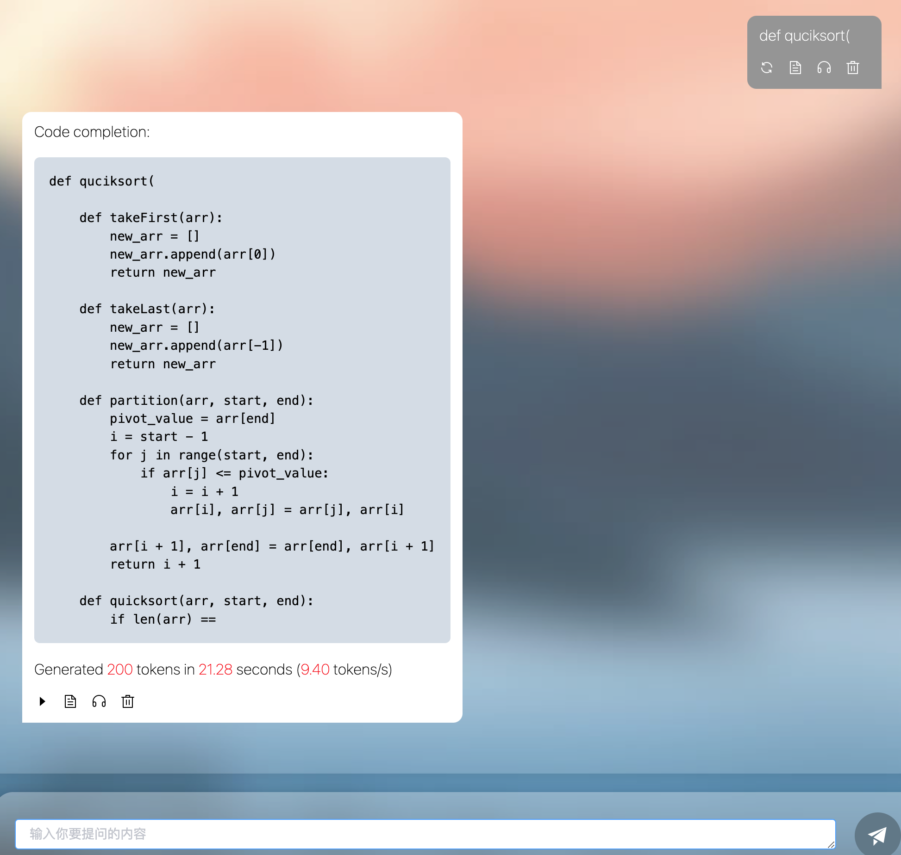
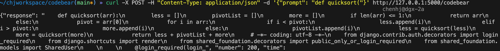

# Codebear
This repository combines **GPTQ 4-bit quantization** and **Speculative Decoding** to accelerate Large Language Models' (LLM) inference for code completion tasks in **personal usage scenarios** (where GPU resources are limited yet there's a pursuit for better performance and faster speed with larger models).

[GPTQ](https://arxiv.org/abs/2210.17323) is a one-shot weight quantization method based on approximate second-order information, that is both highly-accurate and highly efficient. And [Speculative Decoding](https://arxiv.org/abs/2302.01318) is a innovative sampling strategy by using a small approximation model to propose sequences of tokens that will later be checked by a larger model. 

By combining these two techniques, one can even deploy multiple LLMs in a single GPU with limited HBM memory usage. While benefiting from the improved performance brought by larger models, it also helps to accelerate inference speed to some extent.

The flowing figures are tested in a single V100(32GB) by deploying [CodeLlama-34B](https://huggingface.co/codellama/CodeLlama-34b-Python-hf) and [CodeLlama-7B](https://huggingface.co/codellama/CodeLlama-7b-Python-hf) models, with triton-based QuantLinear backend.

|        | 3 prefill + 200th decoding |
|  :----:  | :----:  |
| Memory Usage(GB)  | 27.7 | 


| 3 prefill + 200th decoding| CodeLlama 7B(FP16) |CodeLlama 7B(4Bit) |CodeLlama 34B(4Bit) |Speculative 7B+34B(4Bit)|
|  :----:  | :----:  |:----:  |:----:  |:----:  |
| Inference Speed(Tokens/sec)  | 14.3 | 34.1 | 7.9 | 9.4 | 




<!-- # Update  -->

## Acknowledgement

- Special thanks to [feifeibear](https://github.com/feifeibear) for releasing the implemention of speculative decoding with both Google's and Deepmind's versions([LLMSpeculativeSampling](https://github.com/feifeibear/LLMSpeculativeSampling)).
- Special thanks to [AutoGPTQ team](https://github.com/AutoGPTQ/) for implementing GPTQ algorithm and open source the code.

## Quick Tour
### Requirements
```
triton==2.1.0
auto_gptq==0.7.0
transformers==4.37.2
```

### Step1: Quantize
Download the float model from official([CodeLlama-7B](https://huggingface.co/codellama/) and [CodeLlama-34B](https://huggingface.co/codellama/CodeLlama-34b-Python-hf)), then quantize them.
```bash
#quntize the 7b model
./make_quant.sh -f /PATH/TO/7B/FLOAT/MODEL -q /PATH/TO/7B/QUANT/MODEL
#quntize the 34b model
./make_quant.sh -f /PATH/TO/34B/FLOAT/MODEL -q /PATH/TO/34B/QUANT/MODEL
```
Or you can just download the 4bit quantized model from my Huggingface([CodeLlama-7B-4bit](https://huggingface.co/guaguabear/codebear-7b-4bit) and [CodeLlama-34B-4bit](https://huggingface.co/guaguabear/codebear-34b-4bit))

The basic config of quantization is set to bits = 4, group_num = 128 (can be changed in ./scripts/quantize.py).

### Step2: Serving
Start serving
```bash
./start_server.sh -s /PATH/TO/7B/QUANT/MODEL -l /PATH/TO/34B/QUANT/MODEL -t /PATH/TO/7B/FLOAT/MODEL
```
Default sampling params are set to max_tokens = 200, top_k = 10, top_p = 0.9 (can be changed in ./scripts/serving.py).

Send request (**the model is specially trained for code completion with python**)
```
curl -X POST -H "Content-Type: application/json" -d '{"prompt": "def quicksort("}' http://127.0.0.1:5000/codebear
```



## Future Plans

|        | Progress |
|  :----:  | :----:  |
| fused_flash_attn_MHA triton implemention| todo | 
| fused_flash_attn_GQA triton implemention| todo |
| INT8 KV cache| todo |


## References
```
@article{frantar-gptq,
  title={{GPTQ}: Accurate Post-training Compression for Generative Pretrained Transformers}, 
  author={Elias Frantar and Saleh Ashkboos and Torsten Hoefler and Dan Alistarh},
  year={2022},
  journal={arXiv preprint arXiv:2210.17323}
}

@inproceedings{leviathan2023fast,
  title={Fast inference from transformers via speculative decoding},
  author={Leviathan, Yaniv and Kalman, Matan and Matias, Yossi},
  booktitle={International Conference on Machine Learning},
  pages={19274--19286},
  year={2023},
  organization={PMLR}
}

```